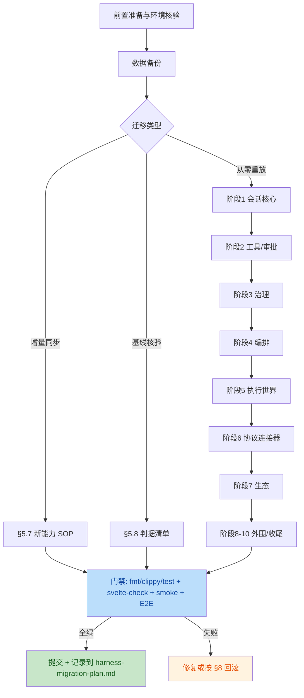

# DeepSeek Harness → ST 主控台（st_control）迁移实施文档

> **文档性质**：面向 AI 执行者的迁移实施规范（implementation spec）。
> **事实来源**：`E:\ST\deepseek-harness-master`（DSH 源码，只读参考）与
> `E:\ST\st_control`（目标项目）的实际代码核查。与
> `st_control/docs/harness-migration-plan.md`（阶段成果记录）互为补充：
> 该文档记录"已做了什么"，本文档规定"如何执行、如何验证、如何回滚"。
> **执行纪律**：AI 执行者必须按本文档的步骤与门禁顺序执行，禁止跳过
> 验证判据；对 DSH 源码目录**只读**，任何情况下不得修改。

---

## 1. 项目背景与迁移目标

### 1.1 背景

- **源项目 DSH**（`E:\ST\deepseek-harness-master`，v0.1.0-rc.5）：DeepSeek AI
  开源的插件式 AI Agent Harness。pnpm monorepo（约 60+ 工作区包），Node
  ^22.19 || >=24，TypeScript 6 strict 全量 ESM，基于 vendored Cordis 框架。
  核心能力：agent-loop（turn/step 循环）、追加式会话事件日志、原子持久化
  （JSONL/SQLite）、工具系统与审批、技能/预设/钩子、沙箱执行、MCP/LSP/ACP
  连接器、JSON-RPC SDK。
- **目标项目 st_control**（`E:\ST\st_control`）：Windows 桌面主控台，
  Svelte 5 + TypeScript + Vite 前端，Rust/Tauri 2 后端。已有微信数据分析、
  知识库、LLM 客户端、自动化、OCR/STT 等模块。

### 1.2 迁移目标

**总目标**：把 DSH 的全部功能面迁移进 st_control 的「Harness」导航界面，
采用**纯原生重写**路线 —— DSH 运行时（packages/ 约 1,981 个 TS 文件、
约 39.4 万行）用 Rust 重写，UI 用 Svelte 5 重建，**零 Node 运行时依赖**。

**子目标**：

| 编号 | 目标 | 度量 |
|---|---|---|
| G1 | 功能零遗漏 | DSH 包级映射表全覆盖（见 §4.1），无"未评估"条目 |
| G2 | 架构原则保真 | 迁移五原则（§1.3）在 Rust 侧有对应机制 |
| G3 | 数据可溯源 | 会话日志（追加式事件流）为唯一上下文来源，UI/回放/遥测均由投影派生 |
| G4 | 工程门禁全绿 | cargo fmt/clippy 0 警告、单测全绿、svelte-check 0/0、smoke 全过、CDP E2E 探针 ALL_PASS |
| G5 | 上游只读 | DSH 源码目录保持只读参考，不做任何修改 |

### 1.3 迁移原则（源自 DSH architecture，执行时的裁决依据）

1. **一切皆插件**：服务注册是效应（effect），可逆；卸载即回滚
   （st_control 对应物：`harness/registry.rs` 的 Cordis-lite
   provide/get/remove + Disposer）。
2. **模型可见 ⟺ 落日志**：进入模型请求的任何内容必须能从会话日志重建；
   新增模型可见输入 ⇒ 必须新增会话事件类型（`HarnessEvent`）。
3. **能力接缝三角色**：Service Definition（接口）/ Service Provider（实现）/
   Consumer（消费，通常是模型工具）**成组迁移，缺一不可**；拆分仅在角色
   独立演化时允许。
4. **显式优于隐式**：默认值由所属实现做显式 resolve（如
   `agent.rs::resolve_provider_model` 的四级回退链），不在 run() 内隐藏兜底。
5. **会话日志为唯一上下文来源**：UI、回放、标题、遥测全部从事件流投影。

### 1.4 当前基线（执行任何新迁移工作前必读）

截至本文档编写时，**阶段 0–10 已全部完成**并通过门禁（详见
`st_control/docs/harness-migration-plan.md`）：

- Rust 侧：`src-tauri/src/harness/` 共 29 个模块（session.rs 36KB、
  agent.rs 27.9KB、tools.rs 17.8KB、pty.rs 14.8KB、sdk.rs 11.5KB 等）。
- 数据侧：SQLite 5 张 `harness_*` 表已建（§4.2）。
- 测试侧：全库 cargo 289 passed；9 个 CDP E2E 探针
  （`.codex_tests/e2e-harness-phase{1..6,78,9,10}.mjs`）。
- 因此，本文档的"迁移步骤"（§5）对 AI 执行者有三种用法：
  a. **核验既有迁移**：按 §5.8 判据确认基线仍然成立；
  b. **增量迁移**：DSH 上游演进后同步新能力（§5.7 SOP）；
  c. **重放迁移**：在新环境从零重放（按阶段顺序执行 §5.1–§5.6）。

---

## 2. 源项目与目标项目环境配置对比

| 维度 | DSH（源） | st_control（目标） | 迁移影响 |
|---|---|---|---|
| 运行时 | Node ^22.19 \|\| >=24，ESM | Rust（tauri 2）+ WebView；无 Node | 纯原生重写，非代码搬运 |
| 包管理 | pnpm@11 workspace（60+ 包） | npm（单包）+ Cargo workspace | npm 侧**零新增依赖**（见 §4.3） |
| 语言/类型 | TypeScript 6 strict | Rust（serde 类型）+ Svelte 5 TS | typert 类型图 → Rust 静态类型 + clippy/rustdoc |
| 框架 | vendored Cordis（插件/事件/服务） | Cordis-lite（`harness/registry.rs` 自研） | 注册表语义保真，Disposer 可逆 |
| UI | React（packages/client/web） | Svelte 5（`lib/harness/HarnessTab.svelte`） | UI 重建，不迁移 React 代码 |
| 数据库 | JSONL（原子写）+ SQLite 会话库 | SQLite `data/control.db`（5 张 harness 表） | 事件日志语义平移到 SQLite 追加表 |
| 配置 | cordis.yml（!!js 求值）+ .env | `config.json` + `data/harness/*` + settings 原子写 | 显式 resolve 替代 yaml 求值面 |
| 进程/沙箱 | landlock（Linux）+ E2B + node-pty | Windows 受限执行世界 + ConPTY（`pty.rs`） | 平台差异：landlock/E2B 不迁移（§4.4） |
| 网络 | webserver（3080）+ apiproxy + SSE | JSON-RPC SDK（127.0.0.1:4770） | 单一本地端点，无 TLS/鉴权（风险 R1） |
| 平台 | macOS/Linux/Windows CI 矩阵 | Windows 优先（ConPTY；旧系统降级） | 兼容性测试聚焦 Windows |
| 门禁 | oxlint/knip/publint/jscpd + vitest 100% 覆盖率 | cargo fmt/clippy/test + svelte-check 0/0 + smoke + CDP E2E | 门禁映射见 §6 |

**路径速查（AI 执行者需要记住的两棵树）**：

```text
E:\ST\deepseek-harness-master\     ← 只读参考
  packages/<group>/<pkg>/src/      ← 迁移语义来源
  docs/subsystems/                 ← 每个能力的契约文档
E:\ST\st_control\                  ← 唯一写入目标
  src-tauri\src\harness\*.rs       ← Rust 运行时落点
  src\lib\harness\HarnessTab.svelte← UI 落点
  src-tauri\src\db.rs              ← SQLite schema 与访问层
  .codex_tests\e2e-harness-*.mjs   ← CDP E2E 探针
  data\                            ← 运行时数据（J-15 布局）
```

---

## 3. 迁移总体流程



---

## 4. 迁移范围界定

### 4.1 代码文件：DSH 包 → st_control 落点映射（权威表）

> 本表是 G1"功能零遗漏"的判定基准。AI 执行者新增/变更映射时必须同步
> 更新本表与 `st_control/docs/harness-migration-plan.md`。

| DSH 包 | 迁移内容 | st_control 落点 | 状态 |
|---|---|---|---|
| core/agent-loop | turn/step 工具循环、取消、错误结构化 | `harness/agent.rs`（+ `llm/agent.rs` 阶段0） | ✅ |
| core/session | 追加式事件日志、投影、标题、修复 | `harness/session.rs` + `db.rs` | ✅ |
| core/scope、core/tools | 作用域工具注册表、守卫管道、schema | `harness/tools.rs` | ✅ |
| core/system-prompt | prompt 分区组装 | `harness/tools.rs`（PromptSection） | ✅ |
| interaction | 审批门控 + 会话级信任 TTL | `harness/approval.rs` | ✅ |
| guard | 工具超时 + 循环卫生（可配置） | `harness/tools.rs` + `settings.rs` | ✅ |
| hooks | 外部钩子桥（PowerShell，≤10s） | `harness/hooks.rs` | ✅ |
| preset / bundle | 预设组合、会话作用域、示例种子 | `harness/preset.rs` | ✅ |
| subagent / workflow / todo / plan / goal / schedule(jobs) | 编排能力 | `harness/{subagent,workflow,schedule}.rs` + session/tools | ✅ |
| shell / subprocess | PowerShell 提供者 + 受限执行世界 | `harness/shell.rs` | ✅ |
| fs | 文件能力接缝 + 路径沙箱 | `harness/fs.rs` | ✅ |
| terminal | 持久终端（cwd 状态保持） | `harness/terminal.rs` + `pty.rs`（ConPTY） | ✅ |
| sandbox | SandboxPolicy / FsPolicy 统一约束 | `harness/shell.rs`/`fs.rs` + settings | ✅（Linux landlock 不迁移） |
| web | 搜索/抓取能力接缝 | `harness/web.rs` | ✅ |
| context / compaction / spill | 请求上下文、压缩、溢写 | `harness/{context,compaction}.rs` | ✅ |
| attachment | 附件入工作区 + 事件 | `harness/attachment.rs` | ✅ |
| sdk | JSON-RPC 2.0（127.0.0.1:4770） | `harness/sdk.rs` | ✅ |
| mcp / lsp / acp | MCP stdio 客户端、LSP hover、ACP 语义 | `harness/{mcp,lsp}.rs` + sdk | ✅ |
| credentials | 凭据引用 + .env 提供者 + 子进程注入 | `harness/credentials.rs` | ✅ |
| skill / feedback / session-query / storage | 技能、反馈、会话搜索、KV | `harness/{skill,feedback,storage}.rs` + session | ✅ |
| identity / settings | 匿名身份、用户设置原子写 | `harness/{identity,settings}.rs` | ✅ |
| self-modification | 动态插件 | `llm/agent_plugins.rs`（阶段0） | ✅ |
| portability（配置束） | presets+skills+mcp+lsp+hooks 导入导出 | `harness/portability.rs` | ✅ |
| apps/cli、python/、website/ | CLI 等价物；Python SDK 与文档站**不迁移**（评估结论） | `harness/sdk.rs`（harness_cli）/ 文档结论 | ✅（映射收口） |
| e2b / native-landlock-run / vendor/* / typert 生成器 | **明确不迁移**：E2B 云沙箱与 Linux landlock 无 Windows 对应物；vendored Cordis 被 Cordis-lite 替代；typert 由 Rust 静态类型替代 | — | 🚫 范围外 |

### 4.2 数据库迁移范围

目标库：`data/control.db`（SQLite，st_control 统一库）。涉及对象：

| 表/目录 | 用途 | 关键约束 |
|---|---|---|
| `harness_sessions` | 会话头（id/title/created_at/updated_at/preset_id） | `preset_id` 经 ALTER TABLE 增量迁移 |
| `harness_events` | 追加式事件日志 | `(session_id, seq)` 索引，seq 会话内单调递增（原则 2/3 的物理基础） |
| `harness_usage` | 每轮 token/成本 | `(session_id)` 索引 |
| `harness_feedback` | 会话反馈 | — |
| `harness_kv` | 存储能力 KV | — |

文件系统数据（`data/harness/`）：`identity.json`（匿名身份）、
`skills/<id>/SKILL.md`、`.env`（凭据提供者）、`spill/`（溢写转录）、
`agent_workspace/`（受限执行世界 cwd，含 `attachments/`）。

**注意**：DSH 的 JSONL 会话文件格式**不迁移**（两段 fsync 原子发布机制
由 SQLite 事务语义替代）；`SESSION_FORMAT_VERSION` 兼容承诺不适用——
st_control 侧事件结构演进时靠 `HarnessEvent` 的 serde 向后兼容与新事件
类型追加，禁止改写既有事件语义。

### 4.3 依赖项范围

- **npm 侧**：**零新增**。`st_control/package.json` 不得引入任何
  `@deepseek-ai/dsh-*` 或 Node 运行时依赖（G5 + 纯原生路线）。
- **Cargo 侧**：允许按需新增；先例：`windows` crate（ConPTY，
  Win32_System_Console/Pipes，见 `pty.rs`）。新增依赖必须过
  `cargo clippy` 0 警告并在 PR 说明用途。
- **DSH 的 patches/node-pty、vendored 包**：不进入 st_control。

### 4.4 配置文件范围

| 配置 | 位置 | 迁移要求 |
|---|---|---|
| st_control 主配置 | 根 `config.json`（J-15 布局，禁止绝对路径） | harness 不新增顶层键；LLM 提供方复用 `llm` 配置段 |
| Harness 用户设置 | `data/harness/`（settings 原子写） | 部署可变量 = 校验过的设置项（超时 5–300s、轮次 1–12、context_budget 4000–128000 等） |
| 凭据 | `data/harness/.env` + 掩码展示 | 子进程统一注入 `HARNESS_CREDENTIAL_<KEY>`；明文不得入日志/UI |
| 预设/技能/MCP/LSP/钩子 | DB + 文件；可经 `harness/portability.rs` 配置束导出/导入 | 导入按 id 合并、同 id 覆盖 |

**禁止**：在 `config.json` 写绝对路径；在代码中硬编码部署可变项
（`DEFAULT_*` 常量不算可配置性，见 DSH 同款原则）。

---

## 5. 详细迁移步骤

### 5.0 通用执行规则（每个阶段/每次增量都适用）

1. **只读纪律**：对 `E:\ST\deepseek-harness-master` 仅执行读取/搜索；
   任何写操作（哪怕注释）都是违规。
2. **小步提交**：一个阶段 = 一组提交；每步门禁（§6）全绿后才进入下一步。
3. **双语注释**：Rust 新模块头部用中文注释说明"为什么"（对齐仓库规范）。
4. **事件优先**：任何模型可见的新输入，先在 `harness/session.rs` 定义
   `HarnessEvent` 变体与投影，再写消费方。
5. **三角色成组**：新增能力必须同时交付 Service Definition / Provider /
   Consumer（原则 3），缺角即未完成。

### 5.1 前置准备（每次迁移会话开始时）

```powershell
# 1) 确认两棵树存在且基线干净
Test-Path E:\ST\deepseek-harness-master\package.json   # True（只读参考）
cd E:\ST\st_control; git status --short                 # 应为空或仅预期改动

# 2) 基线门禁核验（§5.8 判据的前三条）
cd src-tauri
cargo fmt --check
cargo clippy --lib --no-default-features               # 0 警告
cargo test --lib --no-default-features                 # 全绿（基线 289+）

# 3) 前端基线
cd ..; npx svelte-check --output human                  # 0 errors / 0 warnings
```

**判据**：以上全部通过。任何一项失败 ⇒ 先修复基线或按 §8 回滚，
禁止在红基线上开始迁移。

### 5.2 数据备份（涉及 schema/数据变更前，强制）

```powershell
cd E:\ST\st_control
# 应用必须已退出（避免 SQLite WAL 竞态）
$stamp = Get-Date -Format "yyyyMMdd-HHmmss"
Copy-Item data\control.db "data\control.db.bak-$stamp"
Copy-Item -Recurse data\harness "data\harness.bak-$stamp"   # 若本次涉及 harness 数据
```

**判据**：备份文件存在且非空。schema 迁移（ALTER TABLE）失败时以
`.bak-$stamp` 恢复（§8.2）。

### 5.3 代码迁移子步骤（单能力标准流程）

对映射表（§4.1）中的每一项，按以下顺序执行：

1. **读契约**：读 DSH 侧 `docs/subsystems/<cap>.md` 与
   `packages/<group>/<pkg>/src/`，列出：服务接口、事件类型、工具名、
   配置项、失败语义。
2. **事件定义**：在 `harness/session.rs` 增补 `HarnessEvent` 变体 +
   serde + 日志→模型消息投影 + 日志→UI 投影（原则 2）。
3. **接缝实现**：`harness/<cap>.rs` 新建模块：Service trait（Definition）、
   provide_service（Provider，注册进 `registry.rs`）、
   `mod.rs` 挂载 + `harness::init` 接线。
4. **工具接入**：`harness/tools.rs` 注册 Consumer 工具（含
   `requires_approval` 标注、JSON schema、展示意图）。
5. **循环接入**：若能力影响 agent 循环（守卫/拦截/上下文注入），
   修改 `harness/agent.rs`，保持"最终回答单块下发"不变式。
6. **UI 重建**：`HarnessTab.svelte` 增补对应卡片/标签（工具步骤卡、
   审批卡、横幅、治理抽屉标签等），UI 数据一律来自事件投影。
7. **IPC**：命令加入 `ipc_handlers/`，并同步前端服务层调用。

### 5.4 依赖安装

- npm：无需任何安装（§4.3）。
- Cargo：仅在必要时 `cargo add <crate>`；新增后必须
  `cargo clippy --lib --no-default-features` 0 警告 + 全量测试。
- 禁止引入带构建脚本的重量级依赖（对齐 pnpm allowBuilds 的供应链思路）。

### 5.5 配置调整

- 新设置项：进 `harness/settings.rs`，带范围校验（参照超时 5–300s 先例），
  前端治理抽屉可改；**不得**用环境变量或隐藏常量承载部署可变量。
- 新凭据：走 `harness/credentials.rs`（掩码 + .env 提供者 + 子进程注入），
  严禁明文落 `config.json`/日志（对齐 st_control AES-256-CBC 凭据纪律）。

### 5.6 数据库迁移

- 优先 `CREATE TABLE IF NOT EXISTS`（幂等，先例见 `db.rs` 五表）。
- 列级演进用 `ALTER TABLE ... ADD COLUMN ... DEFAULT`（幂等守卫先例：
  `harness_sessions.preset_id`），**禁止** DROP/RENAME 既有列。
- 每次 schema 变更：①先备份（§5.2）②变更 ③新读写路径单测 ④旧数据
  回放测试（E2E 探针的"整页重载日志回放"断言必须仍过）。

### 5.7 增量迁移 SOP（DSH 上游同步 / 新能力）

```text
1. diff 上游：对比 DSH 版本（当前参考 v0.1.0-rc.5）的 packages/ 与 docs/subsystems/，
   识别新增/变更包与事件类型。
2. 查映射表 §4.1：新包 ⇒ 走 §5.3 全流程；既有包变更 ⇒ 评估是否触及
   事件语义（触及则按原则 2 新增事件类型，不得改写旧事件）。
3. 破坏性变更（DSH rc 阶段常态）：st_control 侧保持既有事件兼容，
   仅在 Rust 接口层适配新语义；UI 投影向后兼容。
4. 执行 §5.1→§5.6 相关子集 + §6 全部门禁。
5. 在 harness-migration-plan.md 追加记录行（包、内容、落点、验证数据）。
```

### 5.8 基线核验判据（既有迁移的完整性检查）

| # | 判据 | 命令/方法 | 通过标准 |
|---|---|---|---|
| 1 | Rust 格式/静态检查 | `cargo fmt --check`；`cargo clippy --lib --no-default-features` | 通过 / 0 警告 |
| 2 | Rust 单测 | `cargo test --lib --no-default-features` | 全绿（≥289） |
| 3 | 前端类型 | `npx svelte-check --output human` | 0/0 |
| 4 | Smoke 回归 | `.codex_tests/` 下 smoke-*.mjs 全量 | 全过 |
| 5 | IPC 契约 | `smoke-ipc-contract`（契约命令一致性） | 全一致 |
| 6 | E2E 探针 | 应用 + Vite 运行后依次执行 `e2e-harness-phase{1..6,78,9,10}.mjs` | 9 个探针 ALL_PASS |
| 7 | 服务引导 | 单测 `init_provides_session_store` + 启动日志 `[harness] 运行时已初始化` | 存在 |
| 8 | SDK 端点 | `Invoke-RestMethod http://127.0.0.1:4770`（健康检查） | 正常响应 |

---

## 6. 迁移后验证与测试方案

### 6.1 功能测试

- **单元（Rust）**：每个 harness 模块内联 `#[cfg(test)]`；重点断言：
  注册表可逆性（provide→get→remove→get None）、守卫否决、事件投影
  （chunk 归组、工具步骤挂载）、信任 TTL、沙箱拒绝（越界 cwd/路径）。
- **CDP E2E（真实 UI）**：9 个 `e2e-harness-phase*.mjs` 探针是功能验收
  的最终依据（130+ 断言覆盖：导航、流式回复、审批三按钮、预设禁用、
  子代理、PTY、分叉回放、配置束导入导出等）。运行前提：`npm run dev`
  （Vite:1420）+ `npm run tauri dev`。
- **IPC 契约**：`smoke-ipc-contract` 保证前后端命令签名一致。

### 6.2 性能测试

| 项 | 方法 | 预期 |
|---|---|---|
| 流式首字延迟 | E2E 探针中 assistant_chunk 事件时间戳 | 与直连 LLM 相比无可感知劣化 |
| 大会话投影 | 构造 ≥1000 事件会话后重载，计时日志→UI | 秒级内完成；无 O(n²) 路径 |
| 工具超时守卫 | 预设 1s 超时 + sleep 命令（phase3 先例） | 按时放弃并落日志 |
| 上下文压缩 | `context_budget_tokens` 下限触发 | 摘要替换历史 + Compaction 事件 + spill 落盘 |

### 6.3 兼容性测试

- **Windows 优先**：ConPTY 正常路径 + 旧系统降级（非 PTY 状态保持终端）。
- **数据兼容**：升级安装后旧 `control.db`（无 preset_id 等）可打开并自动
  补列；旧会话事件可回放。
- **边界**：未配置 LLM 提供方时的报错链（resolve 回退链逐级给出可读错误）；
  未配置 LSP 服务器时优雅报错（phase9 先例）。

### 6.4 门禁命令清单（每次交付必跑，顺序固定）

```powershell
cd E:\ST\st_control\src-tauri
cargo fmt --check
cargo clippy --lib --no-default-features
cargo test --lib --no-default-features
cd ..
npx svelte-check --output human
# smoke 全量 + IPC 契约（.codex_tests/ 各脚本，见 AGENTS.md 回归门）
# E2E：先起 npm run dev + npm run tauri dev，再跑 9 个 e2e-harness-*.mjs
# 验收截图存 data\ui-audit\，人工/vision 复检布局
```

---

## 7. 风险评估与应对措施

| # | 风险 | 等级 | 场景与后果 | 应对措施 |
|---|---|---|---|---|
| R1 | SDK 无鉴权暴露（127.0.0.1:4770，本地无鉴权） | 高 | 本机任意进程（含浏览器 DNS rebinding 页面）可调用 session.chat/tool.execute 触发工具执行 | 迁移期保持仅回环绑定；中期方案：启动时生成一次性 token，SDK 校验 `Authorization` 头；token 经 Tauri IPC 仅注入前端。上线对外前必须落地 |
| R2 | 沙箱逃逸（受限执行世界） | 高 | shell/fs/terminal 越界读写用户数据 | 沿用 FsPolicy/SandboxPolicy 统一拦截 + 越界单测 + `allow_workspace_escape` 默认 false；审批门控执行类工具；计划模式只读守卫 |
| R3 | 凭据泄漏 | 高 | 明文进日志/UI/事件流 | credentials 掩码展示 + 子进程环境变量注入；E2E 断言 `JSON.stringify` 不含明文（对齐 DSH redact 先例）；反馈/导出路径复查 |
| R4 | 事件日志语义漂移 | 中 | 改写旧事件导致旧会话无法回放 | 原则 2 强制：新输入=新事件类型；schema 变更走 §5.6 幂等迁移；回放断言进 E2E |
| R5 | DSH 上游 breaking change | 中 | rc 阶段 API/事件频繁变动，增量同步引入回归 | §5.7 SOP：只取语义、保持 st_control 事件兼容；同步后 9 探针全量回归 |
| R6 | Windows 兼容（ConPTY/旧系统） | 中 | PTY 在旧 Windows 不可用或乱码 | 已有降级路径（非 PTY 状态保持终端）；保留 UTF-8/ANSI 剥离测试 |
| R7 | 数据库迁移失败/部分写入 | 中 | ALTER TABLE 中断留下半迁移状态 | §5.2 强制备份 + 幂等 DDL + 失败即以 .bak 恢复（§8.2） |
| R8 | 门禁长尾（E2E 环境不稳） | 低 | CDP 探针因端口/焦点问题抖动 | 固定 Vite:1420；探针串行执行；失败重跑一次仍红才判失败 |
| R9 | 范围蔓延（迁移变改写） | 低 | AI 执行者"顺手"重构 DSH 或 st_control 既有模块 | §5.0 只读纪律 + 小步提交 + PR 描述限缩；G5 判据 |

---

## 8. 回滚机制与应急预案

### 8.1 回滚分层（按影响半径从小到大）

| 层 | 对象 | 回滚方法 | 判定时机 |
|---|---|---|---|
| L1 | 单次代码变更 | `git revert <commit>`（禁止 force/reset；未提交改动 `git restore <path>`） | 门禁任一项红 |
| L2 | 单阶段交付 | revert 该阶段提交组；harness-migration-plan.md 状态行改回 | 阶段验收未过 |
| L3 | schema/数据 | 恢复 §5.2 备份：退出应用 → `Copy-Item data\control.db.bak-$stamp data\control.db -Force` → 重启 | 迁移后启动异常/数据错乱 |
| L4 | 整体功能面 | 「Harness」导航为独立模块（`harness/` + HarnessTab），可整目录 revert；`harness::init` 失败不阻断主控台其余功能（init 内服务注册相互独立） | harness 崩溃波及主程序 |

### 8.2 数据恢复预案（R7 触发时）

```text
1. 立即退出 st_control（防止覆写备份外的 WAL）。
2. 保留现场：Copy-Item data\control.db data\control.db.broken-$stamp
3. 恢复备份（§8.1 L3 命令）。
4. 重启 → 跑 §5.8 判据 1/2/6（快速三项）确认恢复成功。
5. 在 harness-migration-plan.md 记录失败 DDL 与原因，修订 §5.6 后重试。
```

### 8.3 其他应急预案

| 症状 | 处置 |
|---|---|
| SDK 端口 4770 被占用 | `harness/sdk.rs` 启动失败仅记日志（不阻断应用）；排查占用进程；后续考虑端口可配置化 |
| 工具执行挂死 | 守卫超时（默认 30s，spawn_blocking + timeout 放弃等待）兜底；E2E 有 1s 覆盖先例 |
| 沙箱误拦截合法操作 | 确认 cwd 在 agent_workspace；临时经设置放行（`allow_workspace_escape`）并记录事件；禁止代码级放行 |
| 上游同步后大面积红 | 停止增量，L2 回滚该同步提交组；按 §5.7 重新评估破坏面 |

---

## 9. 附录

### 9.1 DSH 概念 → ST 落点速查（执行时常用）

| DSH 概念 | ST 对应物 |
|---|---|
| `SessionEvent` 日志 | `harness_events` 表（seq 单调） |
| `ctx.sessions` / `ctx.tools` / `ctx.llm` / `ctx.agents` | `harness/session.rs` / `harness/tools.rs`（注册表在 `llm/agent.rs` 扩展作用域）/ `llm/client` / `harness/agent.rs` |
| Cordis `ctx.effect()` / registry | `harness/registry.rs` provide + Disposer |
| waterfall 钩子链 | Rust 简化 waterfall（钩子返回 Some 即否决） |
| `assertNever` 判别联合 | Rust `match` 穷尽 + serde tagged enum |
| 会话分叉 `fork(source, boundary)` | `session.rs::fork` + `SessionForked` 事件 |
| 快照/回放（snapshot tests） | CDP E2E 探针 + `harness_export_session` Markdown 转写 |

### 9.2 里程碑判据总表（从零重放时按此验收）

| 阶段 | 核心判据（浓缩） |
|---|---|
| 1 | 导航入口 + 建会话 + 流式回复 + 重载回放（12 断言） |
| 2 | 工具目录 + 审批三按钮 + 信任 TTL + 工具历史回放（21 断言） |
| 3 | 预设禁用生效 + 治理抽屉 + 用量徽标 + 钩子记录（20 断言） |
| 4 | todo/plan/goal 投影 + 子代理 + 定时/工作流（20 断言） |
| 5 | shell/受限世界/终端 cwd 保持与持久化（13 断言） |
| 6 | SDK 会话链路 + compaction + 附件 + MCP 回显（14 断言） |
| 7/8 | 示例预设 + 技能 + 反馈 + 查询 + KV + spill + CLI（14 断言） |
| 9 | 凭据掩码/注入 + LSP hover + ACP 三方法（15 断言） |
| 10 | 分叉溯源 + 每会话预设拦截 + 配置束 + 语音 + PTY（ALL_PASS） |

### 9.3 文档维护约定

- 本文档与 `st_control/docs/harness-migration-plan.md` 成对更新：
  本文档管"规范与判据"，那边管"阶段成果与验证数据"。
- 映射表（§4.1）是单一事实来源；DSH 上游版本变化时先更新 §4.1 与 §2 对比表。
