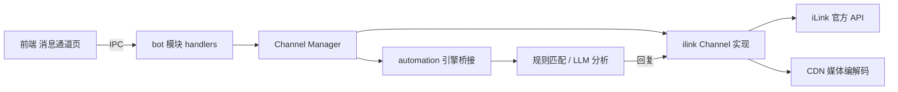

# PRD：微信 ClawBot 消息通道接入（ST 控制台）

| 项目 | 内容 |
| --- | --- |
| 版本 | v0.1（草稿，待确认） |
| 日期 | 2026-08-12 |
| 状态 | 待确认 |
| 负责人 | ST 控制台 |
| 涉及模块 | 后端 Rust（bot 模块）、前端 Svelte（消息通道页）、自动化引擎 |

---

## 1. 背景与目标

### 1.1 背景

ST 控制台目前已有：

- 微信本地数据解密/监控（`wechat/` 模块）
- 自动化规则引擎（`automation/` 模块：规则匹配 → AI 分析 → 派发 → 回复）
- 多模型 LLM 接入、离线语音转写（whisper.cpp）、OCR 等能力

但「主动推送」和「远程双向对话」依赖本机监控，无法在用户不在电脑前时触达微信。腾讯官方已于 2026-03 开放 iLink（ClawBot）能力，允许通过 HTTP/JSON 实现微信机器人会话，是本项目打通「消息推送 + 双向对话」的官方通道。

### 1.2 目标

1. 通过腾讯官方 iLink ClawBot 协议，实现**双向微信消息通道**：系统可主动推送通知给指定微信，也能接收微信消息并回复。
2. 支持**图片 / 文件 / 语音 / 视频 / 文本**全媒体收发。
3. 支持**多账号扫码绑定**，任务派发时选择推送对象。
4. 接受 **24h 连接有效期**，提供桌面提醒 + 一键重扫。
5. 预留**企业微信 / Telegram** 等其他通道，通过统一 Channel 抽象平滑扩展。

### 1.3 非目标（本期不做）

- 群聊消息收发（官方声明 `chatTypes=["direct"]`，不依赖群聊能力）
- 历史消息拉取（官方无历史消息 API）
- 替代本地微信监控（两条通道并存，各司其职）
- 第三方非官方框架（如 itchat / wechaty hook 类），只用官方协议

---

## 2. 需求

### 2.1 用户故事

| 编号 | 用户故事 |
| --- | --- |
| US-01 | 作为用户，我可以在系统里扫码绑定一个或多个微信机器人账号 |
| US-02 | 作为用户，任务完成后，系统可以把通知推送到我指定的微信 |
| US-03 | 作为用户，我在微信里给机器人发消息，系统能按自动化规则理解并回复 |
| US-04 | 作为用户，连接到期前系统提醒我，我点一下即可重新扫码 |
| US-05 | 作为用户，我能看到每个账号的连接状态、剩余有效时间、收发日志 |
| US-06 | 作为用户，发送失败或媒体下载失败时，我能看到明确的错误原因并重试 |

### 2.2 功能需求

#### FR-01 多账号扫码绑定

- 生成登录二维码（`get_bot_qrcode`），前端展示二维码图片，轮询扫码状态。
- 支持二维码状态：`wait` / `scaned` / `confirmed` / `scaned_but_redirect` / `binded_redirect` / `need_verifycode` / `verify_code_blocked` / `expired`。
- 扫码成功后持久化 `bot_token`、`baseurl`、`bot_id`、绑定时间；应用重启后自动恢复连接。
- 支持绑定多个微信，账号之间相互独立、并行轮询。

#### FR-02 24h 到期管理

- 记录每个账号的连接有效期（约 24h），前端显示剩余时间倒计时。
- 到期前（如剩余 30 分钟）发送桌面提醒；到期后标记 `expired`，提供一键重扫。
- 每次重扫生成新的 Bot ID，旧 token 立即失效并清理。

#### FR-03 双向消息收发（文本）

- 收：长轮询 `getupdates`（hold 35s），游标 `get_updates_buf` 必须更新，避免重复/漏收。
- 发：遵循完整发送链路 —— `getconfig` 获取 typing_ticket → `sendtyping(1)` → `sendmessage` → `sendtyping(2)`。
- `from_user_id`、`client_id`、`base_info` 等字段必须补全，否则只有第一条消息能收到回复。
- `context_token` 必须使用当前消息的 token，不可复用历史 token。

#### FR-04 全媒体收发（图片/文件/语音/视频）

- 收：下载 CDN 加密文件 → AES-128-ECB 解密 → 存入本地缓存，前端可直接预览。
- 发：读取文件 → 计算明文 MD5 → 生成随机 AES key → `getuploadurl` 获取上传地址 → POST 上传加密密文 → 读取响应头 `x-encrypted-param` → 构造媒体 item 发送。
- `aes_key` 兼容三种格式：hex（32 字符）、base64(hex 字符串)、base64(原始 16 字节)。
- 语音消息可接入已有离线转写（whisper.cpp）做文本化，走 LLM 回复链路。

#### FR-05 接入自动化引擎

- ClawBot 收到消息后转换为统一消息结构，进入 `automation` 引擎（复用 `process_sync` 规则匹配 → AI 分析 → 派发 → 回复）。
- 回复通过原 Channel 原路返回；规则可配置「推送对象」为指定微信账号。
- 现有 `task_wechat_info.channel` 字段（默认 `''`）作为通道标识，`wechat_local` 与 `ilink` 区分。

#### FR-06 任务派发通道选择

- 自动化规则与手动任务派发中，推送对象可选择：微信 ClawBot 账号（多选其一）、本地微信监控（现有）、预留企业微信 / Telegram。
- 统一的「通道 + 账号 + 联系人」选择器组件。

#### FR-07 消息日志与状态面板

- 展示每个账号：连接状态、剩余有效时间、收发消息数、最近错误、最后活跃时间。
- 消息日志按账号/方向/类型筛选，展示发送状态（成功/失败/重试中）与错误原因。

#### FR-08 统一 Channel 抽象

- 定义 `Channel` trait（`send_text` / `send_media` / `on_message` / `status` / `connect` / `disconnect`），iLink 是第一个实现，企微 / Telegram 后续接入无需改动业务层。

### 2.3 非功能需求

| 类别 | 要求 |
| --- | --- |
| 性能 | 长轮询与多账号并行不得造成空闲 CPU 升高（沿用 tokio 1.48 锁版本经验） |
| 稳定性 | 断线指数退避重连；应用重启后自动恢复所有已绑定账号 |
| 安全 | `bot_token` 等敏感字段加密存储（复用项目已有 AES 能力），前端不暴露完整 token |
| 可维护性 | 协议细节封装在 `bot/ilink/` 内，业务层只依赖 Channel trait |
| 可观测性 | 结构化日志 + 前端状态事件，便于排查 |

---

## 3. 功能模块设计

### 3.1 模块总览



### 3.2 模块职责

| 模块 | 职责 | 关键文件 |
| --- | --- | --- |
| Channel 抽象 | 定义统一接口与消息结构，管理多账号生命周期 | `bot/channel.rs`、`bot/manager.rs` |
| iLink 认证 | 二维码获取、状态轮询、token 持久化 | `bot/ilink/auth.rs` |
| 消息轮询 | `getupdates` 长轮询、游标管理、断线重连 | `bot/ilink/poller.rs` |
| 消息发送 | 文本/媒体发送链路（getconfig → typing → sendmessage） | `bot/ilink/sender.rs` |
| CDN 媒体 | AES-128-ECB 加解密、上传、`x-encrypted-param` 解析 | `bot/ilink/cdn.rs` |
| 协议类型 | 请求/响应结构体、消息模型（容错解析） | `bot/ilink/types.rs` |
| 数据层 | `bot_accounts` 表、消息日志表 | `bot/db.rs` |
| 自动化桥接 | 收消息 → `process_sync`，回复原路返回 | `bot/bridge.rs` |
| IPC 层 | 前端命令：绑定/解绑/状态/日志/发送测试 | `bot/handlers.rs` |
| 前端页面 | 账号卡片、扫码弹窗、倒计时、日志、派发选择器 | `src/lib/bot/*` |

---

## 4. 技术方案

### 4.1 技术选型

| 项 | 选型 | 说明 |
| --- | --- | --- |
| HTTP 客户端 | `reqwest 0.12`（已有） | 长轮询 + 二进制上传 |
| AES-128-ECB | `aes 0.8` + 新增 `ecb` crate | 媒体加解密（需在 Cargo.toml 增加 `ecb`） |
| 哈希 | `md-5`（已有） | 上传前明文 MD5 |
| 随机数 | `rand`（已有） | X-WECHAT-UIN、filekey、AES key |
| 编码 | `base64` / `hex`（已有） | 协议字段编码 |
| 存储 | `rusqlite`（已有，独立 `bot.db` 或主库新表） | 账号与日志持久化 |
| 事件 | Tauri `Emitter` | 状态变化/新消息/到期提醒推给前端 |
| 定时 | `tokio::time` | 倒计时、到期巡检、重连 |

### 4.2 协议要点（已核实）

#### 认证流程

| 步骤 | 接口 | 关键参数 |
| --- | --- | --- |
| 1. 获取二维码 | `POST /ilink/bot/get_bot_qrcode?bot_type=3` | body `{"local_token_list": []}`（失败回退 GET） |
| 2. 轮询状态 | `GET /ilink/bot/get_qrcode_status?qrcode=<qrcode>` | `status=confirmed` 时返回 `bot_token`、`baseurl` |
| 3. 建立连接 | 持久化 token | 每次请求携带统一请求头 |

统一请求头：

```json
{
  "Content-Type": "application/json",
  "AuthorizationType": "ilink_bot_token",
  "X-WECHAT-UIN": "<base64(random_uint32)>",
  "iLink-App-Id": "bot",
  "iLink-App-ClientVersion": "132099",
  "Authorization": "Bearer <bot_token>"
}
```

`base_info` 固定为 `{"channel_version": "2.4.3", "bot_agent": "st-control/1.0.0 (rust)"}`。

#### 收消息

- `POST /ilink/bot/getupdates` 长轮询（hold 35s）。
- 请求：`{"get_updates_buf": "<cursor>", "base_info": {...}}`。
- 响应：`msgs[]`、`get_updates_buf`（必须回写游标）、`longpolling_timeout_ms`。
- 消息内 `from_user_id`（`xxx@im.wechat`）、`to_user_id`、`context_token`、`item_list[]`。
- **顶层 `message_type` 不可靠，必须遍历 `item_list` 判定类型**：1=文本、2=图片、3=语音、4=文件、5=视频。

#### 发文本

```json
{
  "msg": {
    "from_user_id": "",
    "to_user_id": "<from_user_id>",
    "client_id": "openclaw-weixin-<random>",
    "message_type": 2,
    "message_state": 2,
    "context_token": "<当前消息 token>",
    "item_list": [{"type": 1, "text_item": {"text": "回复"}}]
  },
  "base_info": {"channel_version": "2.4.3"}
}
```

前置：`getconfig`（`ilink_user_id` + `context_token` → 缓存 `typing_ticket`）+ `sendtyping(1)`；后置：`sendtyping(2)`。

#### 发媒体（图片/文件/语音/视频）

1. 读文件 → 计算明文 MD5 → `rawsize`；随机 16 字节 AES key（hex）→ 加密后密文大小作为 `filesize`。
2. `POST /ilink/bot/getuploadurl`：

```json
{
  "filekey": "<32位hex随机>",
  "media_type": 1,
  "to_user_id": "<目标ID>",
  "rawsize": "<明文大小>",
  "rawfilemd5": "<明文MD5>",
  "filesize": "<密文大小>",
  "no_need_thumb": true,
  "aeskey": "<16字节key的hex>",
  "base_info": {}
}
```

`media_type`：image=1、video=2、file=3、voice=4。

3. 上传：优先 `upload_full_url`，用 **POST** 提交 AES-ECB 加密后的二进制，`Content-Type: application/octet-stream`。
4. 从响应头 `x-encrypted-param` 读取 `encrypt_query_param`。
5. `sendmessage` 的 `item_list` 构造对应 item，`media: {"encrypt_query_param": ..., "aes_key": "<base64(hex字符串)>"}`。

> ⚠️ `aes_key` 发送编码必须是 `base64(aeskey_hex_string)`（ASCII hex 字符串的 base64），不是 base64(原始字节)；图片 `image_item.aeskey` 是 32 位 hex。

#### 收媒体

- `media.full_url` 指向 CDN 加密文件，下载后 AES-128-ECB + PKCS7 解密。
- `aes_key` 兼容三种格式：hex 32 字符 / base64(hex 字符串) / base64(原始 16 字节)。

### 4.3 数据模型

#### `bot_accounts` 表（新）

| 字段 | 类型 | 说明 |
| --- | --- | --- |
| id | INTEGER PK | 自增 |
| bot_id | TEXT | 扫码生成的 Bot ID |
| name | TEXT | 用户自定义备注（默认「微信-昵称」） |
| bot_token_enc | TEXT | 加密后的 bot_token |
| baseurl | TEXT | 会话接口地址 |
| status | TEXT | `connecting` / `online` / `expiring` / `expired` / `error` / `disabled` |
| connected_at | TEXT | 绑定时间 |
| expires_at | TEXT | 预计到期时间（≈ 24h） |
| last_active_at | TEXT | 最后活跃时间 |
| last_error | TEXT | 最近错误信息 |
| cursor | TEXT | getupdates 游标（内存为主，可持久化） |
| created_at / updated_at | TEXT | 时间戳 |

#### 统一消息结构（`ChannelMessage`）

```rust
struct ChannelMessage {
    channel: String,        // "ilink"
    account_id: String,     // bot 账号 id
    direction: Direction,   // Inbound | Outbound
    from_id: String,        // xxx@im.wechat
    from_name: String,
    to_id: String,
    context_token: Option<String>, // ilink 回话用
    msg_type: MsgType,      // Text | Image | Voice | File | Video
    text: Option<String>,
    media: Option<MediaRef>,// 本地解密缓存路径 + 元信息
    raw: serde_json::Value,
    ts: i64,
}
```

### 4.4 与自动化引擎的衔接

- 现有 `automation/engine.rs::process_sync(conn, msg)` 接收 `serde_json::Value`，ClawBot 消息转换为同一结构（补齐 `sender_username`、`content`、`media_type`、`is_send`、`channel`、`username` 字段）后复用。
- `task_wechat_info.channel` 已存在（默认 `''`），`ilink` 写入该字段即可区分来源，无需迁移。
- 回复：`apply_ai_result` / 派发环节检测 `channel == "ilink"`，通过 `sender.send_text(to_user_id, context_token, reply)` 原路返回。
- 若回复需要媒体（如图片），走 `send_media`。

---

## 5. 目录结构

### 5.1 后端（Rust）

```text
src-tauri/src/
├── lib.rs                     # setup：初始化 bot 模块、启动已绑定账号
├── bot/
│   ├── mod.rs                 # 模块声明 + BotManager 状态
│   ├── channel.rs             # Channel trait + ChannelMessage 类型
│   ├── manager.rs             # 多账号生命周期管理（spawn/stop 轮询任务）
│   ├── db.rs                  # bot_accounts / bot_logs 表 + CRUD
│   ├── bridge.rs              # 收消息 → automation::process_sync；回复原路返回
│   ├── handlers.rs            # IPC 命令（扫码/状态/解绑/日志/发送测试/派发列表）
│   └── ilink/
│       ├── mod.rs
│       ├── types.rs           # 协议请求/响应结构体（serde 容错）
│       ├── auth.rs            # 二维码获取 + 状态轮询 + token 校验
│       ├── poller.rs          # getupdates 长轮询 + 游标 + 重连
│       ├── sender.rs          # getconfig / sendtyping / sendmessage
│       ├── cdn.rs             # 下载解密 / 加密上传 + x-encrypted-param
│       └── crypto.rs          # AES-128-ECB + PKCS7 + aes_key 三格式解析
```

### 5.2 前端（Svelte）

```text
src/
├── App.svelte                 # 侧边栏新增「消息通道」入口
└── lib/
    ├── bot/
    │   ├── BotPanel.svelte            # 消息通道主页面（账号卡片 + 统计）
    │   ├── BotAccountCard.svelte      # 单账号卡片：状态/倒计时/重扫/解绑
    │   ├── QrCodeDialog.svelte        # 扫码弹窗（二维码 + 状态提示）
    │   ├── BotLogView.svelte          # 消息日志（方向/类型/状态筛选）
    │   ├── ChannelPicker.svelte       # 推送对象选择器（供自动化面板复用）
    │   ├── types.ts
    │   └── services/ipc.ts
    └── automation/                    # 扩展：规则/派发表单接入 ChannelPicker
```

---

## 6. 风险点与对策

| 编号 | 风险 | 等级 | 对策 |
| --- | --- | --- | --- |
| R1 | 腾讯官方 API 稳定性、限速、政策变化 | 高 | 依赖官方协议而非逆向；封装隔离；失败降级到本地微信监控通道；保留通道可切换 |
| R2 | 24h 过期，用户不在电脑前导致推送失败 | 高 | 到期前提醒；发送时检测状态并明确报错；支持多账号互为备份 |
| R3 | 媒体 `aes_key` 三种格式兼容 | 中 | 统一 `parse_aes_key` 容错解析，参考开源实现并写单元测试 |
| R4 | 顶层 `message_type` 不可靠 | 中 | 一律遍历 `item_list` 判定，写死校验用例 |
| R5 | `context_token` 复用导致发送失败 | 中 | 每次从最新消息取 token，禁止缓存复用；失败提示重试 |
| R6 | 无历史消息 API | 低 | 只能保证接入后的消息；前端文案说明 |
| R7 | 群聊不支持 | 低 | 官方声明 direct；本期明确不做，未来再评估 |
| R8 | 多账号并行长轮询占用资源/CPU | 中 | 每账号一个 tokio task；连接复用；锁版本沿用 tokio 1.48；实测空闲 CPU |
| R9 | token 安全（本地明文存储风险） | 中 | 加密存储（复用 AES）；不落日志；前端脱敏展示 |
| R10 | 官方突然关闭/变更协议 | 中 | Channel trait 抽象；协议版本参数化；参考实现快速跟进 |
| R11 | 上传/下载超时、文件过大 | 中 | 超时与大小上限配置；分块流式上传；失败重试 + 明确错误 |

---

## 7. 开发顺序（里程碑）

### M0 协议验证（最小闭环）

> 目标：证明扫码 → 收文本 → 回文本全链路通。

- 临时 Rust demo（或复用 bot 模块雏形）实现认证 + 单账号长轮询 + 文本回复。
- 验证 `sendmessage` 必填字段、`sendtyping` 链路。
- 产出：协议验证笔记 + 可用代码骨架。

### M1 基础设施

- `Channel` trait、`ChannelMessage`、`bot/db.rs` 表结构。
- `bot/managers` 多账号生命周期 + 启动恢复。
- IPC 命令骨架 + 前端空页面入口。

### M2 认证与账号管理

- 扫码绑定 / 状态轮询 / 解绑 / token 加密持久化。
- 24h 倒计时、到期提醒、一键重扫。
- 前端账号卡片 + 扫码弹窗。

### M3 消息收发与媒体

- 长轮询消费 + 游标管理 + 重连。
- 文本回复全链路。
- 媒体：下载解密（收）→ 本地缓存预览；加密上传 + `x-encrypted-param`（发）。
- 语音接入离线转写。
- 前端日志视图。

### M4 自动化引擎桥接

- 收消息 → `process_sync` → 规则/LLM → 原路回复。
- 任务派发选择器（ChannelPicker）接入自动化面板。
- `channel` 字段落库与列表区分。

### M5 打磨与验收

- 性能实测（空闲 CPU、多账号并发）。
- 断线/超时/过期边界场景测试。
- 前端深色主题一致性、空状态、错误提示。
- 打包发布。

---

## 8. 验收标准

1. 可扫码绑定 ≥ 2 个微信账号，重启应用后自动恢复在线。
2. 微信发文本 → 系统按规则回复 ≤ 10s（本地 LLM）/ 合理延迟（远程模型）。
3. 系统可向指定微信推送文本与图片/文件，接收方正常收到且可打开。
4. 微信发图片/语音/文件，系统能解密保存、预览（语音可转文字）。
5. 到期前 30 分钟出现桌面提醒，过期后一键重扫成功。
6. 全程空闲 CPU 无明显升高（对比接入前基线）。
7. token 加密存储，日志与前端不出现完整 token。
8. 自动化规则/任务派发可选择微信 ClawBot 账号为推送对象。

---

## 9. 待确认事项

- [x] **需要**「手动从微信数据页给好友发消息」的入口（2026-08-12 确认）
- [x] 媒体缓存目录放在应用数据目录，按账号归档（2026-08-12 确认）
- [x] 多账号数量超过建议值（5 个）时 UI 给出提示；**不做硬限制**（2026-08-12 确认）
- [ ] 是否需要消息模板（预置文本/图片模板快速推送）？（可后续迭代）

### 确认补充需求（2026-08-12）

- FR-09 微信数据页手动发消息：在微信数据面板的联系人/聊天界面提供「发送消息」入口，可选择已绑定的 ClawBot 账号，向该好友推送文本或本地文件（图片/文件），发送结果回显到消息日志。

## 11. 开发进度（2026-08-12）

### 已完成

- [x] **M0/M1 协议验证与基础设施**：iLink 认证（二维码 POST/GET 双通道，已实测官方接口返回 `{qrcode, qrcode_img_content, ret:0}`）、`get_qrcode_status` 长轮询（已实测 hold ~30s 返回 `status:wait`）、Channel 抽象、`bot_accounts`/`bot_logs` 表、token AES-256-CBC 加密存储
- [x] **二维码本地生成**：官方 `qrcode_img_content` 是 HTML 页面而非图片，改用 `qrcode` crate 在 Rust 端生成 SVG 二维码（不依赖腾讯 CDN）
- [x] **M2 多账号管理**：扫码绑定 / 重扫 / 解绑 / 重命名、24h 到期巡检、到期前 30 分钟桌面提醒（`bot://expiring`）、重启自动恢复
- [x] **M3 收发与媒体**：`getupdates` 长轮询 + 游标持久化、文本收发（getconfig → sendtyping → sendmessage）、媒体收发（AES-128-ECB 加解密、aes_key 三格式兼容、CDN 上传 + `x-encrypted-param`、按扩展名/魔数落盘）
- [x] **M4 自动化桥接**：入站消息 → `process_sync` → 异步 AI → 写回；AI 返回 `reply` 字段自动进入待回复队列；应答器（channel=ilink 的 to_reply 任务）自动原路回复
- [x] **M5 前端**：侧边栏「消息通道」页（账号卡片、状态/倒计时、二维码弹窗、发送消息、联系人、消息日志）、微信数据页聊天头部「发消息」按钮（经 ClawBot 推送）

### 待完善

- [ ] 自动化规则/任务面板接入 ChannelPicker（任务派发时选择 ClawBot 推送对象）
- [ ] 入站语音自动离线转写（whisper.cpp，需 local-stt 特性编译环境）
- [ ] 真实扫码 + 收发消息端到端联调（需用户手机扫码）
- [ ] 多账号并发长轮询空闲 CPU 实测

---

## 10. 参考资料

- 腾讯 iLink ClawBot 官方协议（HTTP/JSON）
- Rust 参考实现：`weixin-agent` crate（cdn 上传 / aes_ecb / types）
- `photon-hq/wechat-ilink-client`（TypeScript 类型与上传管道）
- `SiverKing/weixin-ClawBot-API`（24h 重连与踩坑记录）
- 腾讯 `openclaw-weixin` 官方 npm 源码
